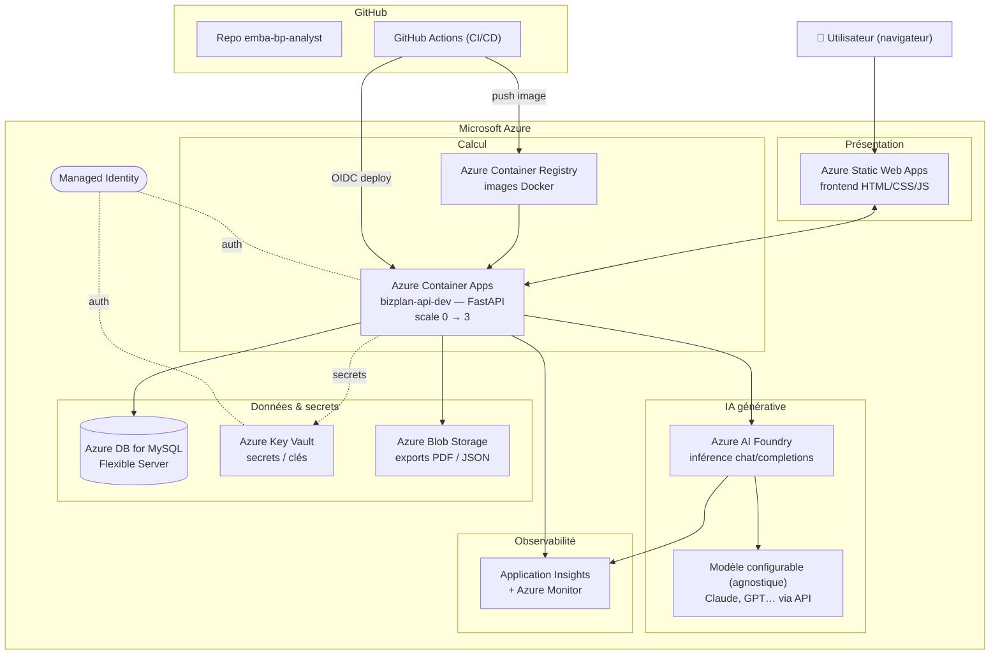
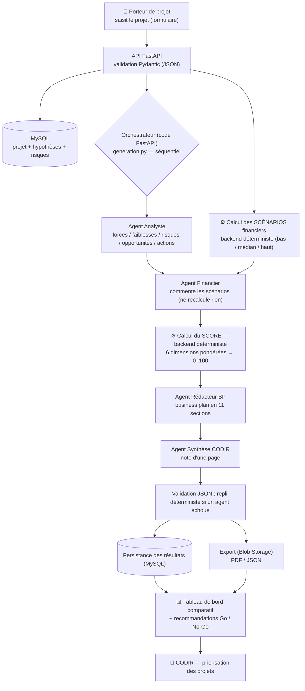
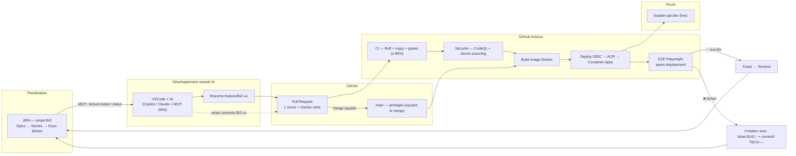

# Diagrammes d'architecture — BizPlan-IA

> Trois vues complémentaires du système : **infrastructure** (déploiement Azure),
> **workflow métier** (parcours de génération du business plan) et **workflow de
> développement** (de JIRA à la production). Diagrammes au format **Mermaid**
> (rendu natif sur GitHub / VS Code).

← Retour au [README](../README.md) · Voir aussi [`architecture.md`](./architecture.md) · [`craftsmanship.md`](./craftsmanship.md)

---

## 1. Infrastructure (déploiement Azure)

Vue des services managés Azure et de leur chaîne de déploiement depuis GitHub.
L'API FastAPI est conteneurisée sur **Azure Container Apps** (scale-to-zero) ;
l'orchestration des agents est **applicative** (code FastAPI), l'inférence étant
servie par **Azure AI Foundry** (`chat/completions`, **modèle agnostique**). Les
secrets vivent dans **Key Vault**, l'authentification inter-services repose sur
des **identités managées**.

---

## 2. Workflow métier (génération du business plan)

Du formulaire du porteur de projet jusqu'à la décision du CODIR. Point clé :
**l'IA juge, le code arbitre** — le score de pertinence est calculé côté backend
de façon déterministe, jamais par l'IA.

---

## 3. Workflow de développement (de JIRA à la production)

Chaîne d'outils streamlinée pour le binôme : chaque maillon automatise le passage
au suivant. Traçabilité totale ticket ↔ code via les *smart commits* `BIZ-xx`.
Un échec E2E après déploiement **crée automatiquement** les tickets de bug et de
correctif dans JIRA.

---

*BizPlan-IA — Executive MBA EPITECH P2026 — Benjamin Guérin & Mauricette.*
